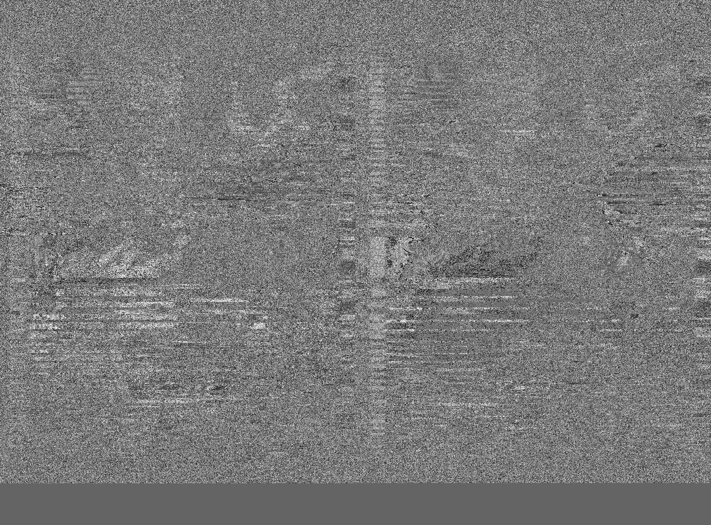

# APT Decoder

This decoder decodes the APT signal received from NOAA weather satellites. This project was developed at the initial stage of the [PicoSat4Bangladesh](https://github.com/picosat) project to get hands-on experience on how satellite signal processing works.


## These resourses were helpful
 - [Documentation of noaa-apt](https://noaa-apt.mbernardi.com.ar/how-it-works.html)
 - [Another APT decoder project](https://github.com/zacstewart/apt-decoder)
 - [Automatic Picture Transmission (APT)](https://www.sigidwiki.com/wiki/Automatic_Picture_Transmission_(APT))

## Installation
```
git clone https://github.com/picosat/APTDecoder.git
cd APTDecoder
pip install -r requirements.txt
```


## Usage
```
python main.py -h
```

## Example 

```
python .\main.py -i .\NOAA18-20221230-215754.wav -o output.png -r
```

## Decoded Image

